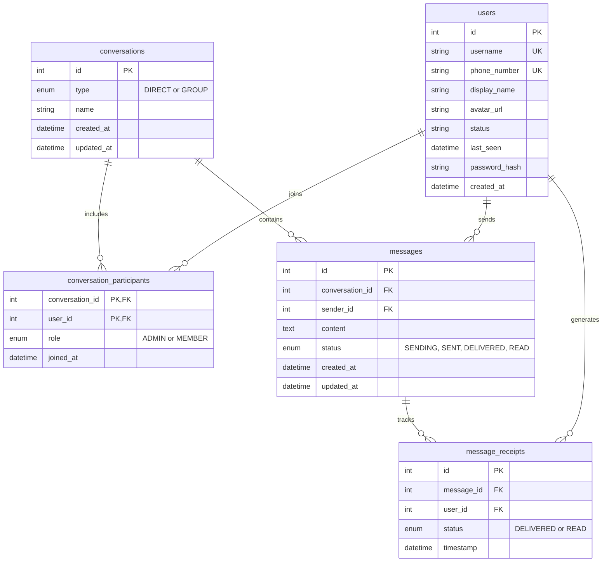

# Database Design: Signal Clone

This document details the database schema designed for our real-time messaging application (Signal Clone). The database is relational, designed with normalization principles, and optimized for fast message retrieval and status tracking.

## Entity-Relationship Diagram

## Tables & Architecture

### 1. `users` Table
Stores all registered user profiles and authentication data.
- **`username`** & **`phone_number`**: Indexed and unique for fast logins and friend-finding.
- **`password_hash`**: Bcrypt-hashed password for security.
- **`status` / `last_seen`**: Enables presence tracking (online/offline indicators).

### 2. `conversations` Table
Represents a chat room. It can be a 1-on-1 direct message or a group chat.
- **`type`**: Enum specifying if it is `DIRECT` or `GROUP`.
- **`name`**: Optional string, only used when `type` is `GROUP`.

### 3. `conversation_participants` (Junction Table)
Resolves the **many-to-many** relationship between `users` and `conversations`. 
- **Composite Primary Key**: `(conversation_id, user_id)` ensures a user cannot join the same conversation twice.
- **`role`**: Used in group chats to distinguish between `ADMIN` (who can add/remove members) and `MEMBER`.

### 4. `messages` Table
Stores the actual chat messages sent within a conversation.
- **Foreign Keys**: Links to `users` (the sender) and `conversations` (the chat room).
- **Index Optimization**: Contains a composite index on `(conversation_id, created_at)` to allow incredibly fast fetching of chronological chat history for a specific conversation.

### 5. `message_receipts` Table
Tracks read receipts (like the double blue ticks in WhatsApp/Signal) for each individual recipient in group chats.
- Instead of keeping a generic "read" status on the `messages` table, this isolated table allows tracking *who* precisely has read or received a message in a multi-user group chat.
- **Composite Index**: Indexed on `(message_id, user_id)` for quick lookup when rendering checkmarks.

## Key Design Decisions
1. **Normalization**: Many-to-many relationships are properly broken down using junction tables (`conversation_participants`). 
2. **Performance Indexes**: Strategic indexes on foreign keys and `created_at` columns ensure that message history queries remain fast even when tables grow to millions of rows.
3. **Data Integrity**: `ON DELETE CASCADE` is applied to foreign keys. For example, if a conversation is deleted, all associated messages, receipts, and participant links are automatically cleaned up without leaving orphaned rows.
